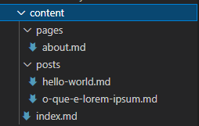

# Meduza
**Gerador de sites estáticos com PHP.**

---

**Meduza** é um [gerador de sites estáticos](https://en.wikipedia.org/wiki/Static_web_page) desenvolvido com [PHP 8](https://https://www.php.net/releases/8.0/pt_BR.php) com suporte a temas e plugins.

[Live Demo](https://meduza-static-site-generator.github.io/sample-blog/)

## Por que?

A motivação por trás do desenvolvimento do **Meduza** foi o desafio de fazer isso e também, porque os outros geradores de sites estáticos existentes - [Hugo](https://gohugo.io/), [Jekyll](https://jekyllrb.com/) e [Pelican](http://blog.getpelican.com/), por exemplo - ou eram bastante complexos para configurar, ou não tinham muitos temas disponíveis.

**Meduza** pode ser só mais um gerador de sites estáticos, mas o desafio de fazê-lo já valeu à pena.

## Requisitos

Atualmente, os requisitos estão especificados no arquivo ```composer.json```, a saber:

```json
"require": {
    "twig/twig": "3.x-dev",
    "ext-yaml": "^2.2",
    "php": ">=8.0.3",
    "league/commonmark": "2.1.x-dev"
},
```

## Instalação

**Meduza** foi criado como um [projeto](https://getcomposer.org/doc/04-schema.md#type) do [Composer](https://getcomposer.org/), então o procedimento padrão de instalação é:

```sh
composer create-project meduza-static-site-generator/meduza my-site "@dev"
```

onde, ```my-site``` é o nome do diretório que você irá utilizar como diretório base do site.

Depois disso, será necessários criar o diretório para construção dos arquivos estáticos. O padrão é ```./build```, mas você pode usar qualquer outro, mesmo fora da estrutura de diretórios do projeto. Só não esqueça de atualizar a configuração:

```yaml
build:
    input: "./content"
```

Para criar um diretório ```build``` dentro da raíz do projeto faça:

```sh
cd my-site
mkdir build
```

## Configuração

**Meduza** suporta múltiplos arquivos de configuração no formato [YAML](https://pt.wikipedia.org/wiki/YAML). Nós fornecemos arquivos de exemplo com as opções documentadas.

Um projeto padrão possui dos arquivos base - ```dev.yml``` e ```prod.yml```. O primeiro tem as configurações para o ambiente de desenvolvimento e o segundo, as configurações para produção. Naturalmente, ```dev.yml``` possui a maioria das configurações.

São distribuídos alguns arquivos de configuração complementares, relativos aos plugins e tema padrão. Eles estão no diretório ```config```.

Quaisquer arquivos de configuração podem ser mesclados utilizando-se a opção ```import```:

```yaml
import:
    - "./config/theme/alembic.yml"
    - "./config/plugin/catloger.yml"
    - "./config/plugin/time-read.yml"
    - "./config/plugin/resumizer.yml"
```

Importar um arquivo de configuração irá sobreescrever qualquer configuração já carregada. Isso acontece, por exemplo, no arquivo ```prod.yml```, que importa ```dev.yaml```e depois sobreescreve algumas das configurações. Por isso, é importante observar a posição de ```import``` dentro de cada arquivo.

Os arquivos de configuração podem estar em qualquer lugar.

## Temas e Plugins

**Meduza** suporta temas e plugins (que não vem instalados na criação do projeto). Uma lista de temas disponíveis pode ser obtida consultando os [repositórios](https://github.com/orgs/meduza-static-site-generator/repositories) iniciados por ```meduza-theme-*``` e por ```meduza-plugin-*```.


Para instalar um tema, o procedimento recomendado é:

```sh
composer require meduza-static-site-generator/meduza-theme-alembic
```

Neste exemplo, o tema [Alembic](https://github.com/meduza-static-site-generator/meduza-theme-alembic) será instalado.

Temas podem requerer alguns plugins. Para facilitar, os plugins requeridos já vem especificados na seção ```require``` do arquivo ```composer.json``` do tema.

Para instalar um plugin não isntalado automaticamente com o tema, faça:

```sh
composer require meduza-static-site-generator/meduza-plugin-catloger
```

Adicionalmente, temas e plugins devem ser configurados. Por isso, cada tema/plugin tem um arquivo de configuração padrão com as opções suportadas e com comentários de documentação.

Então, basta importar com ```import``` os arquivos de configuração do tema/plugins para ter tudo funcionando.

## Conteúdo estático

Você pode querer acrescentar algum conteúdo estático ao seu site.

Para isso, basta colocá-lo no diretório ```static```, inclusive a estrutura de diretórios desejada. Tudo que estiver ali será copiado para ```build```.

## Conteúdo do site

O conteúdo do site propriamente dito é feito através de arquivos [markdown](https://pt.wikipedia.org/wiki/Markdown). Esses arquivos podem estar em qualquer lugar, entretanto o padrão é o diretório ```content```.

Os arquivos *markdown* possuem duas seções: o *frontmatter* e o *markdown* propriamente dito.

Exemplo de *frontmatter* (deve ser a primeira coisa no arquivo).
```yaml
---
title: "Blog de exemplo"
layout: "index"
---
```

O *frontmatter* tem apenas duas opções obrigatórias:

- *title*: o título do documento
- *layout*: o layout do documento, que deve corresponder a um dos layouts fornecidos pelo tema escolhido.

Note que *layout* pode ser definido pela opção ```defaults``` das configurações.

O diretório ```content``` pode ter qualquer estrutura de arquivos e subdiretórios. O padrão é:



Note que essa estrutura é arbitrária e será replicada em ```build```. Você pode especificar a estrutura que desejar. Entretanto, a opção de configuração ```defaults``` está ligada à essa estrutura, então lembre-se de atualizá-la se for o caso.

Quanto ao *markdown*, utilizamos como *parser* o [The PHP League/CommonMark](https://commonmark.thephpleague.com/) com a opção *GitHub Flavored Markdown (GFM)*.

## Utilitários

Atualmente **Meduza** fornece no diretório ```bin``` dois *scripts* utilitários, em versões para *Windows* e *Linux*.

```build.bat``` e ```build.sh```: fazem a construção do conteúdo estático. Deve ser fornecido como parâmetro o arquivo de configuração base para o *build*:

Para *Linux*...
```sh
bin/build.sh dev.yml
```

... ou para *Windows*...

```batch
bin\build.bat dev.yml
```

```serve.bat``` e ```serve.sh```: executa uma instância do servidor HTTP embutido no PHP no host/porta *localhost:8000* e com o diretório root em ```build```. Por isso, se você trocou o diretório de *build* (ou se quiser mudar o host/porta), deve executar o servidor manualmente com ```php -S localhost:8000 -t meu_outro_diretorio```.

## Como contribuir

Para contribuir com o projeto, faça o seguinte:

- Crie um *fork*;
- Clone o *fork* e crie um novo *branch* para a sua contribuição;
- Envie suas alterações para o *fork*;
- Crie um *pul request*.

Será interessante você criar um *issue* no repositório oficial para a sua alteração e referenciá-la no nome do seu *branch* e nos *commits*. Também referencie seu *pull request* nas *issue*. Isso agilizará a análise da sua contribuição.

## Licença

**Meduza**, seus temas e plugins são licenciados sob a [MIT Licence](https://github.com/meduza-static-site-generator/meduza/blob/main/LICENSE)